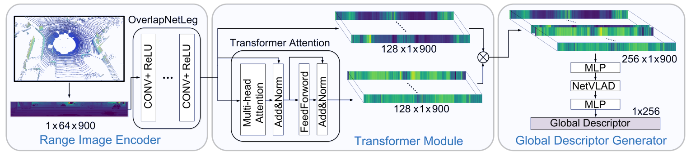

## Junyi Ma

###  👋  👋  👋

I’m currently a Master student in the Intelligent Vehicle Research Center at Beijing Institute of Technology. I received the B.Eng degree from Beijing Institute of Technology in 2020. Some of my works are publicly available at: https://github.com/BIT-MJY    
  
---

## Publications

## 2022  
#### OverlapTransformer: An Efficient and Yaw-Angle-Invariant Transformer Network for LiDAR-Based Place Recognition   
**Junyi Ma**, Jun Zhang, Jintao Xu, Rui Ai, Weihao Gu, and Xieyuanli Chen*    
IEEE Robotics and Automation Letters  
[[Paper](https://ieeexplore.ieee.org/document/9785497)][[Code](https://github.com/haomo-ai/OverlapTransformer)]    

---

#### A Comparative Study of Deep Reinforcement Learning-based Transferable Energy Management Strategies for Hybrid Electric Vehicles    
Jingyi Xu, Zirui Li, Li Gao, **Junyi Ma**, Qi Liu, and Yanan Zhao  
2022 IEEE Intelligent Vehicles Symposium (IV 2022)  
[[Paper](https://arxiv.org/pdf/2202.11514.pdf)][[Code](https://github.com/BIT-XJY/RL-based-Transferable-EMS)]    

---

## 2021  
#### Mutual Pose Recognition Based on Multiple Cues in Multi-robot Systems
**Junyi Ma**, Guangming Xiong*, Jingyi Xu, Jiarui Song, and Dong Sun  
2021 IEEE International Conference on Unmanned Systems (Best Paper)  
[[Paper](https://ieeexplore.ieee.org/document/9641141)][[Code](https://github.com/BIT-MJY/Mutual-Pose-Recognition-Based-on-Multiple-Cues-in-MRS)]    

---

## Dataset

### Haomo Dataset
The dataset was collected by a mobile robot built by HAOMO.AI Technology company equipped with a HESAI PandarXT 32-beam LiDAR sensor in urban environments of Beijing.   
[[Description](https://github.com/haomo-ai/OverlapTransformer/tree/master/Haomo_Dataset)]  

---

## Open-source Projects

####  Multiple Lidar Calibration  [[Code](https://github.com/BIT-MJY/Multiple_Lidar_Calibration)]
####  Active SLAM Based on Information Theory [[Code](https://github.com/BIT-MJY/Active_SLAM_Based_on_Information_Theory)]
####  Occupancy Grid Mapping [[Code](https://github.com/BIT-MJY/occupancy_grid_mapping)]
